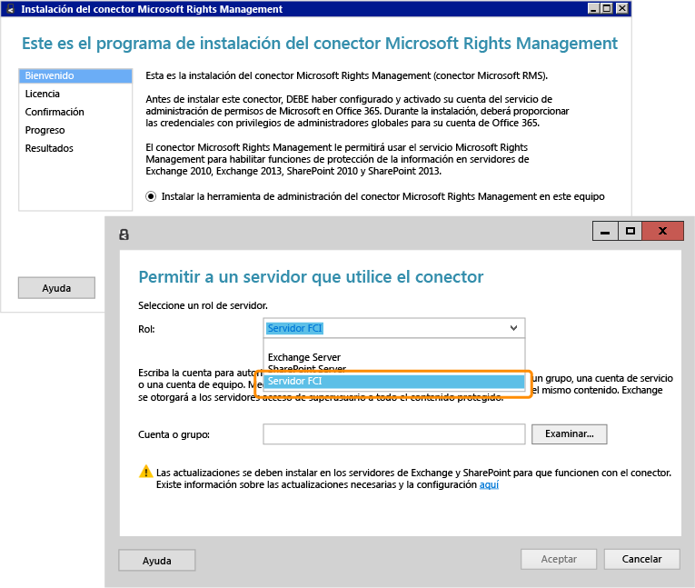

# Imagen a pantalla completa: Instalaci&#243;n y configuraci&#243;n del conector RMS para FCI

Volver a [Azure RMS en acción: Protección automática de archivos en los servidores de archivos con Windows Server y la infraestructura de clasificación de archivos](http://technet.microsoft.com/library/jj585026.aspx).

